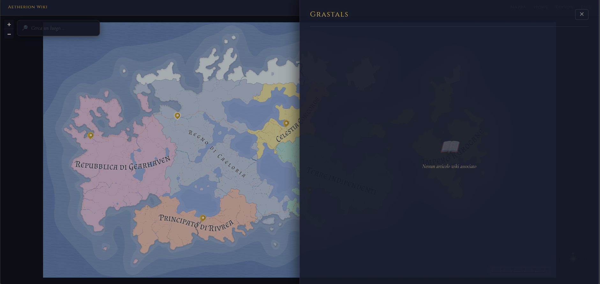
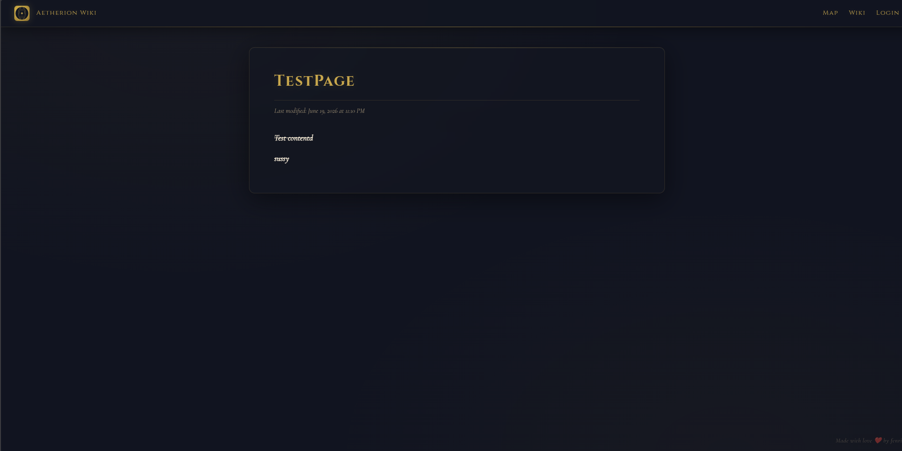
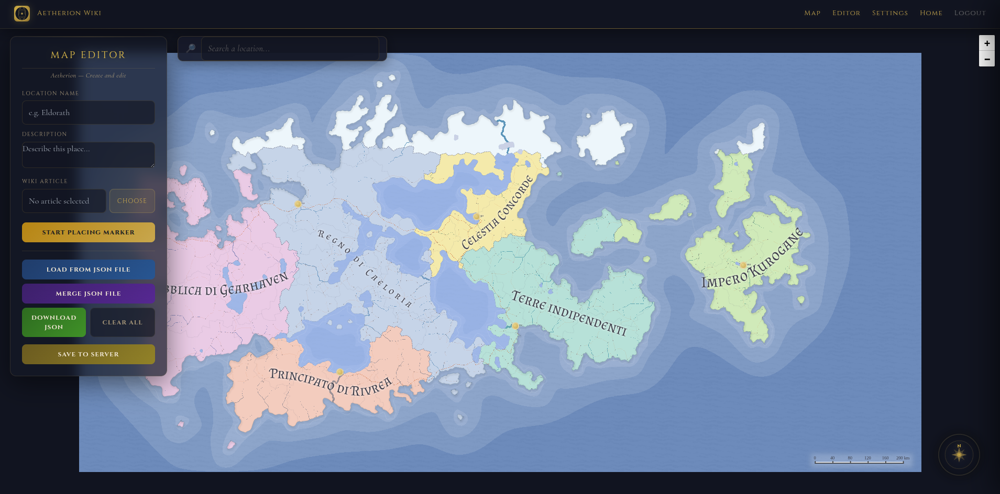
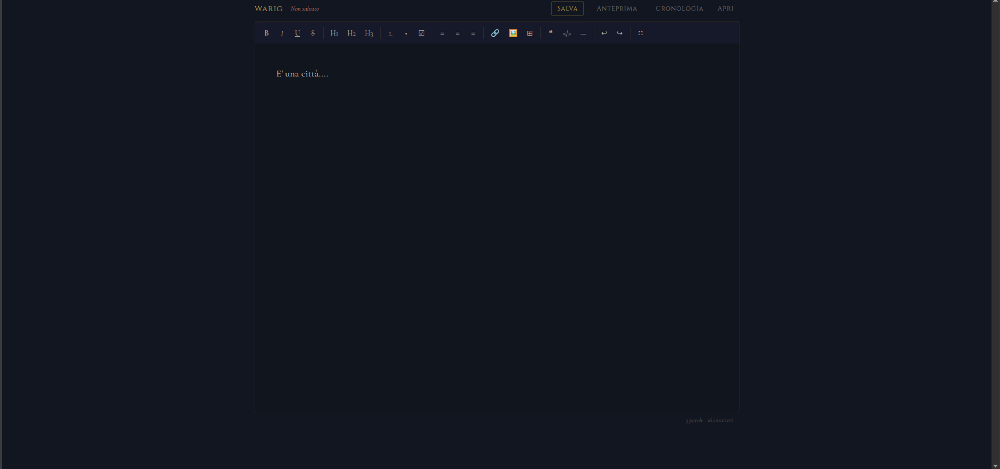

# Interactive Fantasy Map with Integrated Wiki

[](LICENSE)

A complete fantasy world wiki + interactive map, running in a single Docker container.

## Screenshots

| Interactive Map | Wiki Page |
|:---:|:---:|
|  |  |

| Map Editor | Wiki Editor |
|:---:|:---:|
|  |  |

## Live Demo

**[👉 interactive-fantasy-map-wiki.hf.space](https://fenrir2232-interactive-fantasy-map-wiki.hf.space)**

**Default credentials:** `admin` / `admin`

## Features

- **Interactive map** — Leaflet with CRS.Simple, zoom and pan, compass, place search
- **Integrated wiki** — Markdown pages with BlockNote editor (React/Notion-style), image upload, version history
- **Side panel** — click a marker on the map to read its linked wiki article
- **Map editor** — create, edit, delete markers; import/merge/export JSON; save to server
- **Admin panel** — protected login to edit the wiki and the map
- **Settings panel** — customize world name, map image & dimensions, favicon, social sharing (og:title, og:description, og:image), colors with live preview
- **Dynamic OG tags** — each wiki page gets custom open-graph metadata for rich link previews
- **Translation system** — all UI strings in JSON files; add a new language by creating a single `lang/xx.json` file

## Documentation

Full guide on translating the UI, customizing the theme, adding markers, creating wiki pages, and more: [`DOCS.md`](DOCS.md)

## Getting Started

```bash
docker compose up -d
```

This pulls the image from **ghcr.io** and creates a `./data/` folder with all wiki pages, uploaded images, map markers, and branding files.

The default `docker-compose.yml`:

```yaml
services:
  aetherion:
    image: ghcr.io/fenrir22/interactive-fantasy-map-wiki:latest
    ports:
      - "3000:3000"
    environment:
      - ADMIN_USER=admin
      - ADMIN_PASS=admin
      - SESSION_SECRET=change-me-to-a-random-string
      - APP_LANG=eng
      - DATA_PATH=/app/data
    volumes:
      - ./data:/app/data
    restart: unless-stopped
```

Open in your browser:

| Page | URL |
|------|------|
| Map | http://localhost:3000/map/ |
| Wiki | http://localhost:3000/wiki/ |
| Settings (admin) | http://localhost:3000/settings |

## Docker Images

Pre-built images are available on GitHub Container Registry:

- `ghcr.io/fenrir22/interactive-fantasy-map-wiki:latest`
- `ghcr.io/fenrir22/interactive-fantasy-map-wiki:v1.0`

To build locally instead:

```yaml
services:
  aetherion:
    build: .
    # ...
```

## Data Persistence

All user data is stored under a single configurable path:

| Data | Location (under `DATA_PATH`) |
|------|---------------------------|
| Wiki pages | `wiki/` |
| Wiki images | `wiki/images/` |
| Wiki version history | `wiki/versions/` |
| Map markers | `map/markers.json` |
| Map image & assets | `map/mappa.svg`, `map/custom_map.png`, etc. |
| Branding config | `branding.json` |

### Default path

By default (`DATA_PATH` unset), data is stored alongside the application code (current behavior).

### Custom path

Set the `DATA_PATH` environment variable to use a different location:

```yaml
services:
  aetherion:
    image: ghcr.io/fenrir22/interactive-fantasy-map-wiki:latest
    volumes:
      - ./data:/app/data
    environment:
      - DATA_PATH=/app/data
```

The application automatically creates the required directories and copies default HTML files on first startup, so an empty volume works out of the box.

## Development without Docker

```bash
npm install
node server.js
```

## Configuration

Create a `.env` file:

```env
ADMIN_USER=admin
ADMIN_PASS=your_password
SESSION_SECRET=some_random_string
APP_LANG=eng
DATA_PATH=/app/data
```

### Environment variables

| Variable | Default | Description |
|----------|---------|-------------|
| `ADMIN_USER` | `admin` | Admin login username |
| `ADMIN_PASS` | `admin` | Admin login password |
| `SESSION_SECRET` | `aetherion-secret-change-me` | Session encryption secret |
| `APP_LANG` | `eng` | UI language (`eng`, `it`, or custom) |
| `DATA_PATH` | `__dirname` | Base path for all user data (wiki, map, branding) |
| `PORT` | `3000` | Server port |

### Language

The UI supports **English** and **Italian** via `APP_LANG`:

```yaml
environment:
  - APP_LANG=eng   # English
  - APP_LANG=it    # Italian
```

All user-facing strings (navigation, buttons, placeholders, dates, alerts, map UI, editor UI, settings) switch language automatically. The wiki content (markdown files) is not affected.

### Adding a new language

1. Copy `lang/eng.json` to `lang/fr.json` (or any language code)
2. Translate all values in the new file
3. Set `APP_LANG=fr` in `docker-compose.yml`
4. Rebuild: `docker compose up -d --build`

That's it — no code changes needed.

### Settings

Access `/settings` (admin login required) to customize:

| Setting | Description |
|---------|-------------|
| World Name | Changes the site title and navbar brand |
| Map | Upload a new map image, set width/height in pixels |
| Favicon | Upload your own site icon (SVG, PNG, ICO, max 2MB) |
| Social Sharing | Custom og:title, og:description, og:image for link previews |
| Colors | Live preview of gold, background, text colors with real-time theme preview |

## Project Structure

```
.
├── data/                   # User data (auto-created, git-ignored)
│   ├── wiki/               # Wiki pages, images, versions
│   ├── map/                # Map assets, markers, uploaded files
│   └── branding.json       # Customizable site branding
├── map/                    # Map source HTML files (code)
│   ├── index.html          # Public map viewer
│   ├── editor.html         # Marker editor (admin)
│   ├── settings.html       # Branding & settings panel (admin)
│   └── mappa.svg           # Base map image
├── wiki/                   # Wiki source files (code default data)
├── lang/                   # Translation files
│   ├── eng.json            # English translations
│   ├── it.json             # Italian translations
│   ├── loader.js           # Translation loader
│   └── maps.js             # HTML template renderer
├── client/                 # BlockNote editor frontend
│   └── editor/             # React + Vite editor app
├── server.js               # Express server
├── Dockerfile              # Node 20 Alpine build
├── docker-compose.yml      # Container orchestration
└── package.json
```

## License

MIT © 2026

This software is provided "as is", without warranty of any kind.
